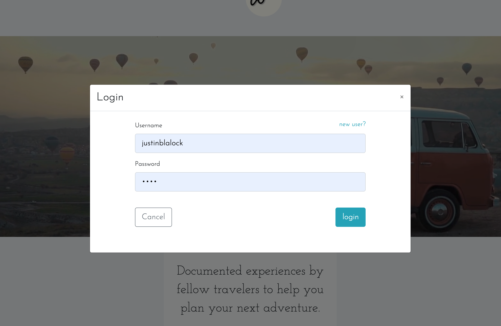
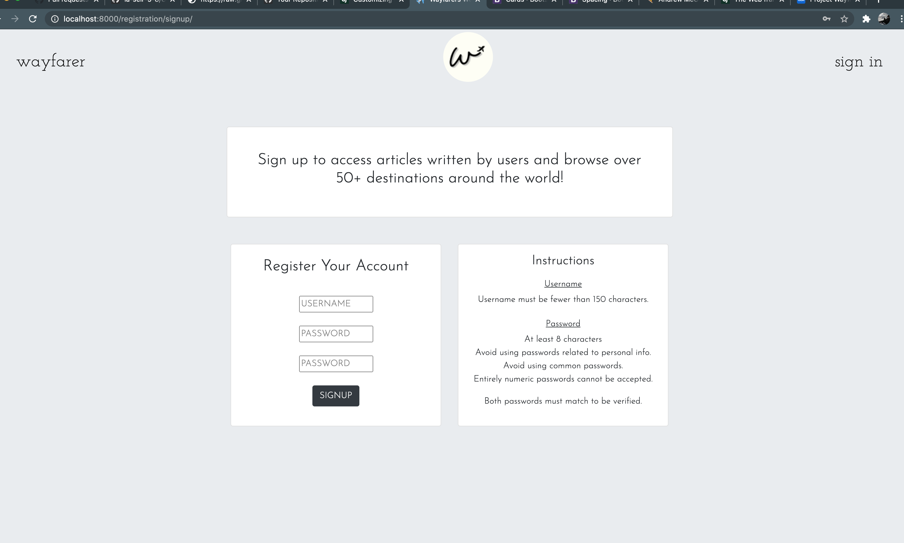
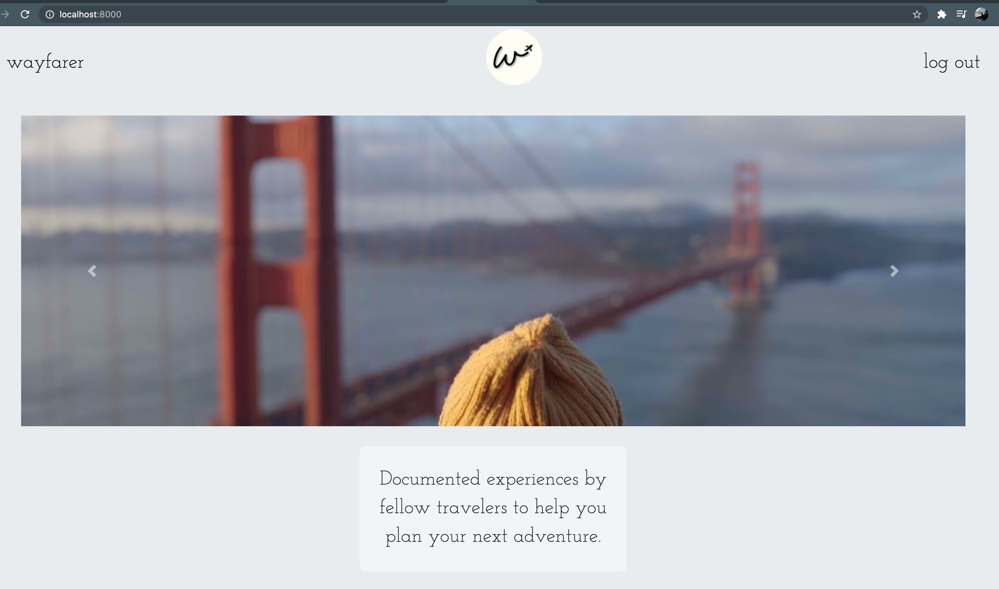
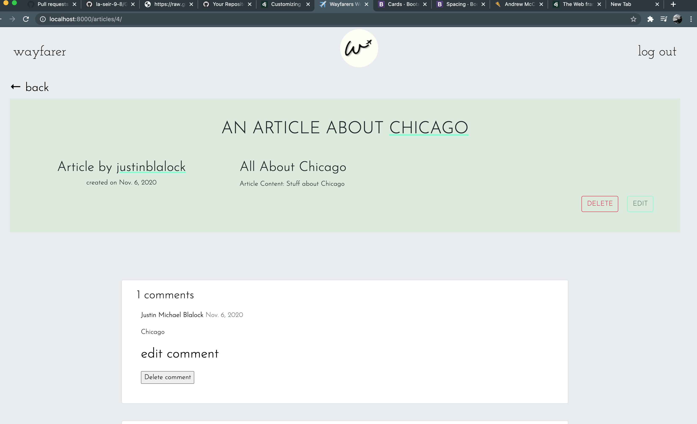

# Exploring Odyssey
Interactive traveling blog to post articles and learn from other user's experiences. 
Exploring Odyssey also offers an internal API hosting 60+ destinations including travel tips and important info before you next vacation!
## Index:

- [Scope](#Scope)
- [User Stories](#user-stories)
- [Wireframes](#wireframes)
- [Data Models](#data-models)
- [Milestones](#milestones)

## Scope

The final objective is to build an app where users can users track articles and comments associated to a city.  Users will be able to visualize thier own articles and comments and search for cities to add new articles and comments to. Refer to milestones for full sprints breakdown.

##### Technologies in play

- Python
- Django
- PostGreSQL
  - CrispyForms
  - Bootstrap4
  

## User Stories

Project Wayfarer user can use this app to track cities, articles, and comments, to help them manage their travels and explorations.

#### Non-authenticated Users can:

- View landing page
- Sign Up to Wayfarer

#### Authenticated users can

- View landing page
- Search for cities
- Input Articles to Cities
- Comment on Articles on Cities
- View their profile page
- View their Article history
- View past comment information
- Can edit and delete prior articles and comments
- Update their profile image

## Wireframes

### Landing

Users will see input to log in or create account

### Registration

Users who need to create will be guided to registration page

### Home Page

Build out city database/log individual articles, title, data, submit to memory.

This will allow user to input Article and comment data to database, as well as have access to edit past Articles and comments.  These articles will be visible with hyperlinks to view article and comment details

### Show Article Page

Details each article by: (name, date/time, comments)

View 1

## Data Models

### User

- userId
- name
- email
- password
- imgURL
- joined on
- current city

### City

- name
- image

### Article

- title
- content
- created_on
- author (FK)
- city (FK)

### Comment

- name
- email
- body
- created_on
- article (FK)

### Reviews (stretch goal, inter app sharing between users, posting to social)

- userId
- workouts

## Milestones

## Sprint 1: Basic Auth & Profiles

**A user should be able to:**

1. Navigate to "/" and see a basic splash page with:

- The name of the website.
- Links to "Log In" and "Sign Up".

2. Sign up for an account.
3. Log in to their account if they already have one.
4. Be redirected to their public profile page after logging in.
5. On their public profile page, see their name, the current city they have set in their profile, and their join date.
6. See the site-wide header on every page with:

- A link to "Log Out" if they're logged in.
- Links to "Log In" and "Sign Up" if they're logged out.

7. Update their profile by making changes to their name and/or current city.
8. See the titles of all the posts they've contributed (start with pre-seeded data).
9. Click on the title of one of their posts and be redirected to a "show" page for that post.
10. View post "show" pages with title, author, and content.

### Bonuses

**A user should be able to:**

1. See a "default" profile photo on their profile page before adding their own photo.
2. Update their profile photo (consider using Paperclip or Uploadcare).
3. See their profile photo next to their posts.
4. Receive a welcome email after creating an account.

## Sprint 2: CRUD

**A user should be able to:**

1. View the "San Francisco" page (at "/cities/1") including:

- The site-wide header.
- The name of the city.
- An iconic photo of the city.

2. View a list of posts on the San Francisco page:

- Sorted by newest first.
- With the post titles linked to the individual post "show" pages.

3. Use an "Add New Post" button on the San Francisco city page to pull up the new post form.
4. Create a new post for San Francisco<!--(**Hint:** <a href="http://guides.rubyonrails.org/routing.html#nested-resources" target="_blank">nested resources</a>)-->.
5. Click "Edit" on ANY individual post, and be redirected to the edit form.
6. Click "delete" on ANY individual post, then:

- See a pop-up that says: "Are you sure you want to delete #{title}?"
- If the user confirms, delete the post.

### Bonuses

**A user should be able to:**

1. Visit city pages via pretty urls, like "/cities/san-francisco".
2. Visit user profile pages via pretty urls, like "/users/james".
3. On a city's page:

- See post content truncated to 1000 characters max, with a link to view more.
- See a relative published date, e.g. "2 days ago".

## Sprint 3: Validations & Authorization

**A user should be able to:**

1. View city pages for "London" and "Gibraltar".
2. Verify that a new post they create is successfully published on the correct city page.

A user CANNOT save invalid data to the database, according to the following rules:

3. A user CANNOT sign up with an email (or username) that is already in use.
4. A post's title must be between 1 and 200 characters.
5. A post's content must not be empty.

A user is authorized to perform certain actions on the site, according to the following rules:

6. A user MUST be logged in to create/update/destroy resources.
7. A user may only edit their own profile and edit/delete their own posts.

#### Bonuses

**A user should be able to:**

1. View an error message when form validations fail, for the following validations:

- Title must be between 1 and 200 characters.
- Content must not be empty.

2. View only the 10 most recent posts on a city page (pagination), with

- A link/button to the "Next" 10.
- A link/button to the "Previous" 10.

3. See a list of the city pages they've contributed to, on their public profile
4. See the number of posts they've written for each city, next to the city's name in their profile.
5. View all vagabond cities as markers/pins on a map on the site's homepage.
6. Click on a pin on the homepage map and be redirected to the corresponding city page.

## Sprint 4: Commenting

### Bonuses

**A user should be able to:**

1. Comment on individual posts.
2. See the number of comments a post has on the post's "show" page.
3. See the number of comments they've left, on their public profile.
4. Only add a comment when logged in.
5. Only edit/delete their own comments.
